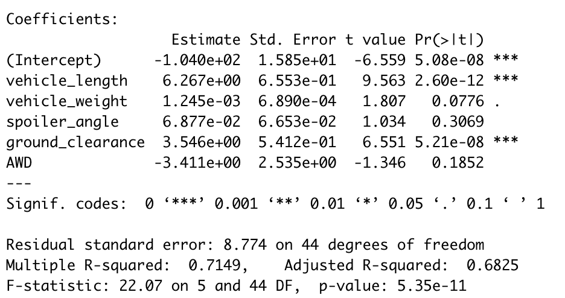
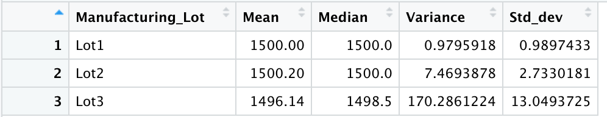
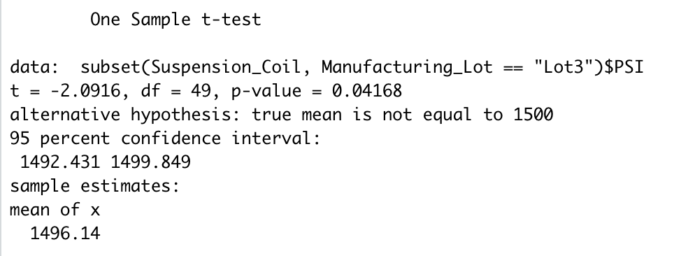

# MechaCar_Statistical_Analysis
Performing Statistical analysis for AutosRUs'

## Linear Regression to Predict MPG

* Looking at our figure above we can see that "Vehicle_Length" and "Ground_Clearance" provide a 'non-random' amount of variance to Miles per Gallon (MPG).
* Our intercept of slope of the data is small enough where it could be considered 0. 
* Although there is many other factors and ways to look at how MPG is measured the current data is a great starting point to see generally how it all correlates 

## Summary Statistics on Suspension Coils

* Looking at the graphic above, Lots 1 and 2 are withing the 100 pound varience specifications but Lot 3 is not with a varience of over 170. 

## T-Tests on Suspension Coils

* Again our data shows the only Manufacturing Lot that is significantly different from the population mean is Lot 3.  
(at a significance level of .05)

## Study Design: MechaCar vs Competition

* Another thing that could be considered vs the competition in regards to MPG is the typpe and size of the tires on our Mecha Car vs the competition
* The null hypothesis would be that tire size and type dont make a difference while the alternative hypothesis would be that there is a difference. 
* A statistical test would be looking at the data for the different types of tires that could possible affect how the car drives according to MPG. For example, tire weight, tire track, and tire life-span.
